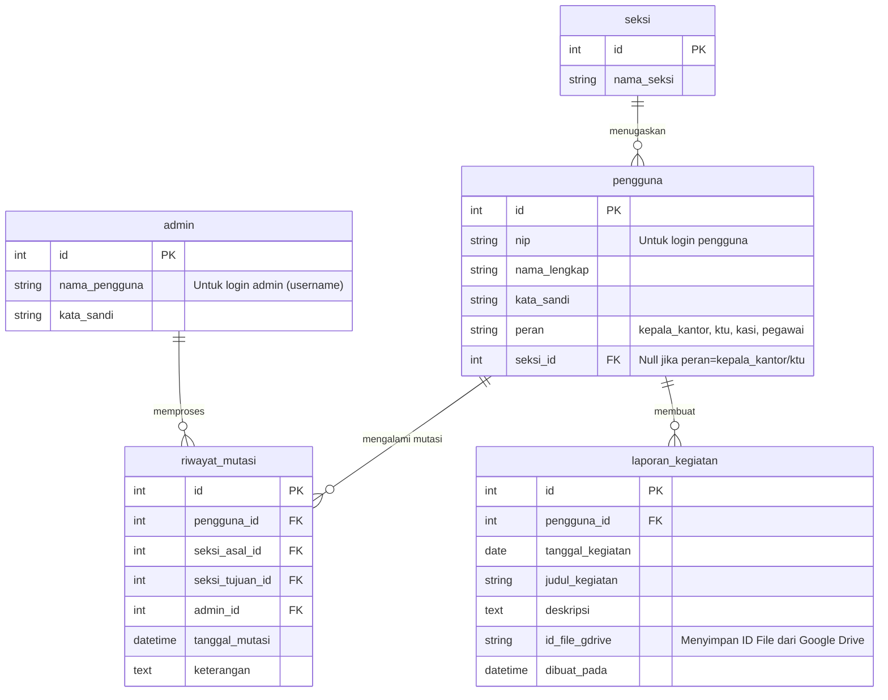

# Rancangan Aplikasi E-Laporan Kemenag

Dokumen ini berisi rancangan sistem untuk aplikasi E-Laporan (Laporan Kegiatan Elektronik) di lingkungan Kementerian Agama (Kemenag). Seluruh struktur penamaan (database, model, kontroler, antarmuka, dan rute) dirancang murni menggunakan Bahasa Indonesia sesuai spesifikasi.

## 1. Teknologi (Tech Stack)
- **Backend (API):** Laravel
- **Frontend (Tampilan):** Vue.js (direkomendasikan menggunakan Inertia.js untuk integrasi mulus dengan Laravel)
- **Pemrosesan Gambar:** Intervention Image (PHP) untuk menempelkan cap waktu dan kompresi ukuran.
- **Penyimpanan Berkas (Storage):** Google Drive (via Laravel Flysystem Google Drive API)
- **Basis Data:** MySQL / PostgreSQL

## 2. Aktor dan Hak Akses (Role & Permission)
Sistem memisahkan tabel secara fisik untuk `Admin` dan `Pengguna`.

| Aktor | Login Menggunakan | Hak Akses Utama |
| :--- | :--- | :--- |
| **Admin** | `nama_pengguna` (username) | Mengelola data utama (seksi, pengguna), serta **memproses pemindahan (mutasi) pengguna antar Kasi/Seksi**. |
| **Pengguna (Pegawai)** | `nip` | Membuat laporan kegiatan harian/bulanan, melihat riwayat laporannya sendiri. |
| **Kepala Kantor & KTU** | `nip` | Memiliki akses *Super Viewer*. Dapat melihat **semua** laporan kegiatan dari **seluruh pengguna** di kantor. |
| **Kasi (Kepala Seksi)** | `nip` | Memiliki akses *Section Viewer*. Hanya dapat melihat laporan kegiatan dari pengguna/pegawai yang berada di **seksi yang sama**. |

## 3. Struktur Penamaan (Bahasa Indonesia)

### A. Basis Data (Tabel) & Model (Laravel)
1. Tabel: `admin` | Model: `Admin`
2. Tabel: `seksi` | Model: `Seksi`
3. Tabel: `pengguna` | Model: `Pengguna`
4. Tabel: `laporan_kegiatan` | Model: `LaporanKegiatan`
5. Tabel: `riwayat_mutasi` | Model: `RiwayatMutasi`

### B. Kontroler (Controllers)
- `OtentikasiKontroler` (Proses masuk/keluar aplikasi)
- `DasborKontroler` (Tampilan utama, metrik laporan)
- `LaporanKontroler` (Proses CRUD Laporan, menangani logika gambar)
- `PenggunaKontroler` (Proses mengelola Data Pegawai/Kasi/dll)
- `MutasiKontroler` (Proses logika pencatatan mutasi antar seksi)

### C. URL / Rute (Routes)
- `/masuk` (Halaman Login Admin & Pengguna)
- `/keluar` (Proses Logout)
- `/dasbor` (Halaman Utama)
- `/admin/pengguna` (Manajemen Pengguna)
- `/admin/mutasi` (Proses Pemindahan Pegawai)
- `/laporan/tambah` (Formulir Laporan Baru)
- `/laporan/daftar` (Lihat Riwayat Laporan)

### D. Tampilan (Views - Komponen Vue.js)
- `Halaman/Masuk.vue`
- `Halaman/Dasbor.vue`
- `Halaman/Laporan/Daftar.vue`
- `Halaman/Laporan/Formulir.vue`
- `Halaman/Pengguna/Daftar.vue`
- `Halaman/Mutasi/Formulir.vue`

## 4. Alur Kerja Fitur Khusus

### A. Logika Laporan & Pemrosesan Gambar (Otomatisasi)
Saat pegawai mengunggah laporan beserta lampiran foto kegiatan, proses di belakang layar (*backend*) akan melakukan:
1. **Pemberian Cap Waktu (Timestamping):** Sistem akan mendeteksi waktu saat gambar diunggah dan menempelkan teks berisi tanggal serta jam (*watermark*) tepat pada area foto.
2. **Ubah Ukuran & Kompresi (Resizing & Compression):** Agar tidak membebani kapasitas, gambar akan diubah dimensi dan dikurangi kualitasnya (*quality downgrade*) secara proporsional hingga file akhirnya berukuran **maksimal 50Kb**.
3. **Penyimpanan Cloud (Google Drive):** Setelah gambar diproses (dicap dan dikompresi), berkas tidak disimpan di server lokal melainkan langsung diunggah ke Google Drive menggunakan integrasi *Service Account*. ID Berkas (*File ID*) atau Tautan (*URL*) dari Google Drive akan disimpan di kolom `id_file_gdrive` pada tabel `laporan_kegiatan`.

### B. Alur Pemindahan (Mutasi) Pegawai
1. **Admin** mengakses rute `/admin/mutasi`.
2. Admin memilih pegawai yang akan dipindah dan memilih "Seksi Tujuan".
3. **Proses di Backend**:
   - `MutasiKontroler` melakukan pembaruan (*Update*) data `seksi_id` pegawai.
   - Sistem akan menyimpan jejak perpindahan ini ke tabel `riwayat_mutasi` (mencatat seksi asal, seksi tujuan, dan admin yang bertugas memindahkan).

## 5. Relasi Basis Data (Entity Relationship)

